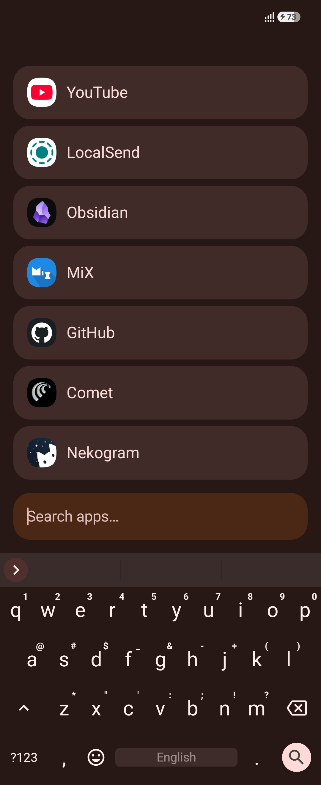

# Home

A minimalist Android home screen written in Kotlin for Android 11+ (API 30+).

<p align="center">
  
</p>

## Features

- **Minimalist UI**: Shows pinned apps on an empty query; search bar sits directly above the keyboard.
- **Fuzzy Search**: Tolerates typos and partial queries; press Enter to launch the top match.
- **Pinned Apps**: Long-press in search to pin/unpin; drag-and-drop favorites to reorder.
- **Work Profile Support**: Seamless multi-profile support with badging and independent pinning.
- **Material You**: Dynamic colors on Android 12+; follows system light/dark theme.
- **Privacy-First**: No internet access, no ads, and no `QUERY_ALL_PACKAGES` permission.

## Building

Requires JDK 17 and Android SDK 35.

```sh
./gradlew assembleDebug
```

Or using the helper script:

```sh
./scripts/build.sh
```

The APK will be at `app/build/outputs/apk/debug/app-debug.apk`.

## Installation

1. Install the APK:
   ```sh
   adb install -r app/build/outputs/apk/debug/app-debug.apk
   ```
2. Set **Home** as your default launcher in **Settings → Apps → Default apps → Home app**.
